# Architektura systemu

```js
const system = FileAttachment("data/system.json").json();
```

## Diagram systemu


## Mapa portów

```js
const portData = system.services.map(s => ({
  ...s,
  range: s.port < 5000 ? "Aplikacje" : s.port < 8000 ? "Storage" : "Gateway"
}));

Plot.plot({
  title: "Mapa portów — serwisy systemu",
  width: 720,
  height: 300,
  marginLeft: 160,
  x: {label: "Port", grid: true, domain: [0, 60000]},
  color: {domain: ["active", "inactive"], range: ["#22c55e", "#ef4444"], legend: true},
  marks: [
    Plot.dot(portData, {
      x: "port",
      y: "name",
      fill: "status",
      r: 12,
      stroke: "#fff",
      strokeWidth: 1,
      tip: true,
      title: d => `${d.name}\nPort: ${d.port}\nStatus: ${d.status}\nTyp: ${d.type}`
    }),
    Plot.text(portData, {
      x: "port",
      y: "name",
      text: d => d.port,
      dx: 20,
      fontSize: 11,
      fill: d => d.status === "active" ? "#22c55e" : "#ef4444"
    })
  ]
})
```

## Status serwisów

```js
Inputs.table(system.services, {
  columns: ["name", "port", "status", "type"],
  header: {
    name: "Serwis",
    port: "Port",
    status: "Status",
    type: "Typ"
  },
  format: {
    status: d => d === "active" ? "🟢 Aktywny" : "🔴 Nieaktywny"
  }
})
```

## Flow agentów

```mermaid
graph LR
    User["👤 User"] -->|Zapytanie| Jimbo["🎯 Jimbo"]
    Jimbo -->|Routing| Router{MoE Router}
    Router -->|Kod| FC["⚡ FastCode"]
    Router -->|Analiza| Norbert["🔍 Norbert"]
    Router -->|SEO| Elwirka["🌐 Elwirka"]
    Router -->|Research| Angels["📚 Angels"]
    
    FC -->|Review| Norbert
    Norbert -->|Feedback| FC
    Angels -->|Dane| Jimbo
    Elwirka -->|Raport| Jimbo
    
    Jimbo -->|Odpowiedź| User

    style User fill:#334155,stroke:#00FF41,color:#fff
    style Jimbo fill:#1e40af,stroke:#60a5fa,color:#fff
    style Router fill:#7c3aed,stroke:#a78bfa,color:#fff
    style FC fill:#059669,stroke:#34d399,color:#fff
    style Norbert fill:#d97706,stroke:#fbbf24,color:#fff
    style Elwirka fill:#db2777,stroke:#f472b6,color:#fff
    style Angels fill:#2563eb,stroke:#93c5fd,color:#fff
```



## Agenci — profil

<div class="grid grid-2">

```js
Plot.plot({
  title: "Modele per agent",
  width: 340,
  height: 250,
  marginLeft: 100,
  x: {label: "Liczba modeli", grid: true},
  color: {scheme: "Spectral"},
  marks: [
    Plot.barX(system.agents, {
      y: "name",
      x: "models",
      fill: "models",
      tip: true,
      sort: {y: "-x"}
    }),
    Plot.ruleX([0])
  ]
})
```

```js
Plot.plot({
  title: "Narzędzia per agent",
  width: 340,
  height: 250,
  marginLeft: 100,
  x: {label: "Liczba narzędzi", grid: true},
  color: {scheme: "Blues"},
  marks: [
    Plot.barX(system.agents, {
      y: "name",
      x: "tools",
      fill: "tools",
      tip: true,
      sort: {y: "-x"}
    }),
    Plot.ruleX([0])
  ]
})
```

</div>

## Stos technologiczny

<div class="grid grid-3">
  <div class="card">
    <h3>Frontend</h3>
    <ul>
      <li>DEVz HUB (vanilla JS)</li>
      <li>Observable Framework</li>
      <li>Chart.js 4.4.1</li>
      <li>Three.js r128</li>
      <li>Feather Icons</li>
    </ul>
  </div>
  <div class="card">
    <h3>Backend</h3>
    <ul>
      <li>Python HTTP Server</li>
      <li>Agent Zero Framework</li>
      <li>MCP Gateway</li>
      <li>ChromaDB</li>
      <li>Node.js 22</li>
    </ul>
  </div>
  <div class="card">
    <h3>AI / ML</h3>
    <ul>
      <li>Claude 4.5 Sonnet</li>
      <li>GPT-4o</li>
      <li>DeepSeek R1</li>
      <li>Qwen 2.5 72B</li>
      <li>Bielik 7B (local)</li>
    </ul>
  </div>
</div>
